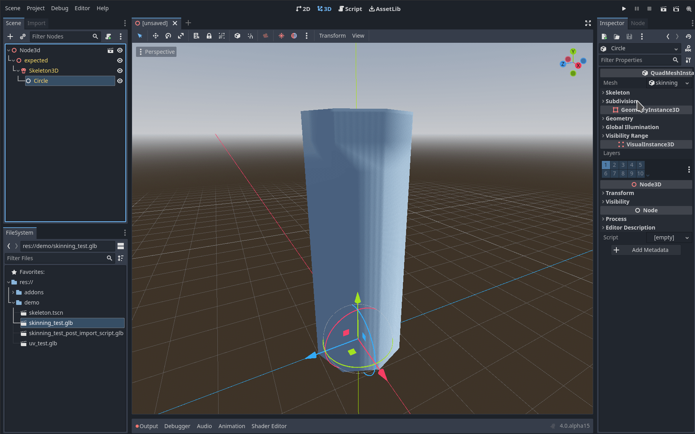

 
# Godot Subdiv

|  |  |
| ------------------------------------ | ------------------------------------------------ |

## Getting Started

### Importing

After installing the addon and enabling it in the settings you can select the custom **Godot Subdiv Importer** in the import settings for any glb or gltf file. You can also use the **subdivision settings in any scene importer** to be able to make use of all the features of the 3d import pipeline from Godot.
There you will see three options:

| SubdivMeshInstance3D                                                                                                                                                                                                    | BakedSubdivMesh                                                                                                                                                   | ArrayMesh                                                                                                 |
| ----------------------------------------------------------------------------------------------------------------------------------------------------------------------------------------------------------------------- | ----------------------------------------------------------------------------------------------------------------------------------------------------------------- | --------------------------------------------------------------------------------------------------------- |
| The only option that **doesn't bake**. Skinning and blend shape changes get processed by CPU and then directly thrown at the RenderingServer. This is useful if you have a changing mesh or changing subdivision level. | **Bake at runtime**: Useful for large reused meshes. Baking can take quite some time though so if space isn't an issue, the ArrayMesh might be the better option. | **Bake at import**: The greatest advantage of this is, after importing you can remove godot subdiv again. |

Adjust the subdivision level, click reimport and you should see your mesh subdivided.

### Modeling Tips

OpenSubdiv has a great section on [modeling for subdivision](https://graphics.pixar.com/opensubdiv/docs/mod_notes.html). Not all of them apply for Godot Subdiv though: You can currently only import either quad only meshes to use the Catmull-Clark scheme or any other mesh which will default to the Loop subdivision scheme. 

### Building the project yourself

To build this project you need to have SCons installed, otherwise everything is included in the project.

\
For just building and trying out the project do
```bash
scons target=template_debug
```
in the cloned folder. 

For running the tests do
```
scons -Q tests=1 target=template_debug
```
which will run simple doctest tests when starting godot on the terminal:
```
path/to/godot --editor --path ${workspaceFolder}/project
```

See more in the [SConstruct](SConstruct) file

## FAQ

### How to create a mesh only containing Quads?

In Blender you can go in Edit Mode and go Select->Select All by Trait->Faces by Sides and set it to Not Equal To 4. After removing the then selected faces and replacing them with quads, Quad import will work.

## Acknowledgements

- [OpenSubdiv](https://github.com/PixarAnimationStudios/OpenSubdiv) files in [thirdparty/opensubdiv](thirdparty/opensubdiv) licensed under [Modified Apache 2.0](thirdparty/opensubdiv/LICENSE.txt)
- [Godot3 module for opensubdiv](https://github.com/godot-extended-libraries/godot-fire/tree/feature/3.2/opensubdiv-next) by fire that was referenced for subdivision implementation
- [Template used](https://github.com/nathanfranke/gdextension), includes the used github workflow and was easy to setup

## License

[MIT](LICENSE)

Thirdparty notices are in [THIRDPARTY.md](THIRDPARTY.md).
